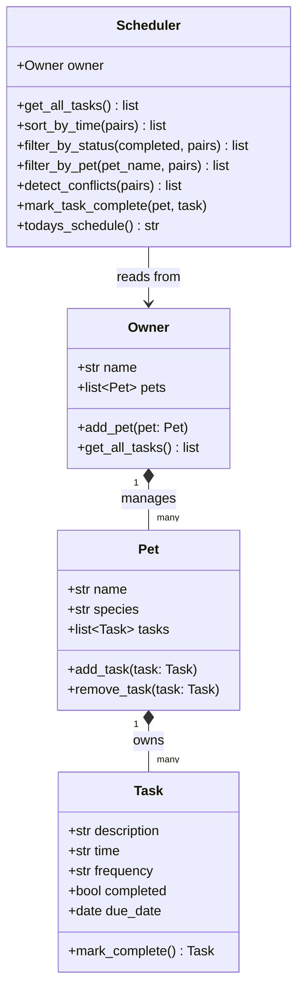

# PawPal+ — Smart Pet Care Manager

PawPal+ is a modular pet care management system built with Python OOP and a Streamlit UI. It helps pet owners track daily routines — feedings, walks, medications, and appointments — while using algorithmic logic to sort, filter, and detect scheduling conflicts.

---

## Repo Structure

```
├── pawpal_system.py     # Logic layer — Owner, Pet, Task, Scheduler classes
├── main.py              # CLI demo script (verifies backend logic)
├── app.py               # Streamlit UI (connects frontend to backend)
├── tests/
│   └── test_pawpal.py   # Automated pytest suite (14 tests)
├── reflection.md        # Design decisions, tradeoffs, AI strategy
└── requirements.txt     # Python dependencies
```

---

## Getting Started

```bash
pip install -r requirements.txt
```

Run the CLI demo to verify backend logic:

```bash
python main.py
```

Launch the Streamlit app:

```bash
streamlit run app.py
```

Run the test suite:

```bash
python -m pytest
```

---

## Features

### Core OOP Design
- **`Task`** — dataclass with description, time (HH:MM), frequency (`once`/`daily`/`weekly`), completion status, and due date.
- **`Pet`** — dataclass holding pet identity and an owned list of `Task` objects.
- **`Owner`** — aggregates multiple pets; flattens the pet–task tree with `get_all_tasks()`.
- **`Scheduler`** — algorithmic brain that orchestrates all smart features below.

### Smarter Scheduling
- **Sort by time** — tasks returned in chronological HH:MM order via `sorted()` with a lambda key.
- **Filter by status** — separate pending and completed tasks instantly.
- **Filter by pet** — view only a single pet's schedule (case-insensitive).
- **Recurring tasks** — completing a `daily` or `weekly` task automatically creates the next instance using `timedelta`; one-off tasks simply stay complete.
- **Conflict detection** — single-pass dictionary scan flags any two tasks at the exact same time and surfaces a warning in both the CLI and the Streamlit UI.

---

## System Architecture (UML)



---

## Testing PawPal+

```bash
python -m pytest
```

The suite covers 14 behaviors: task completion, recurrence (daily/weekly/once), sort correctness, filter correctness (including edge cases like empty list and case-insensitive lookup), conflict detection (true positives and no false positives), and scheduler integration.

**Confidence level: 4/5 stars** — all critical paths pass; missing UI-level and malformed-input tests.

---

## 📸 Demo

*(Add a screenshot of your running Streamlit app here)*
